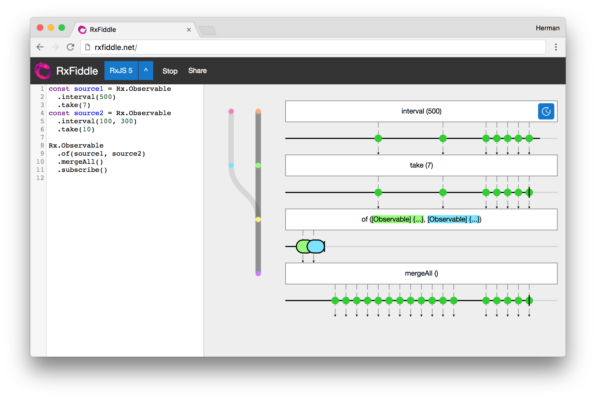

# RxFiddle for RxJS

RxFiddle is a debugger for Reactive Extensions (Rx). 
Add this (rxfiddle) module to your applications repository to inspect your
Observable data flow on [RxFiddle.net](https://rxfiddle.net).



## Getting started

````javascript
/* File: your-application.js */
import { Observable } from "rxjs"
import RxFiddle from "rxfiddle"

RxFiddle.serve({ port: 8080 })

/* Rest of your application here */
Observable
  .of(1, 2, 3)
  .map(x => x * 2)
  .subscribe()
````

Then run your application (`node your-application.js`) and 
visit [rxfiddle.net](https://rxfiddle.net) entering `localhost:8080` as the port.
Note that RxFiddle works completely on your machine only when using websocket collectors: 
no code and or event data is send to rxfiddle's servers. 
If you're afraid it does, feel free to run the [RxFiddle App](https://github.com/hermanbanken/RxFiddle) 
on your own machine.

## Features
See the [RxFiddle repository](https://github.com/hermanbanken/RxFiddle) for the full list of features.

## Collectors
RxFiddle works by means of a visualizer and *collectors* which can parse
syntax and instrument (compiled) code to collect the lifecycle of Observables:

- creation of Observable sequences
- subscriptions in a Observable sequence
- *next*, *error* and *complete* events in Observable sequence

Existing collectors:

- [x] [JavaScript](https://github.com/hermanbanken/RxFiddle/tree/master/rxfiddle-js-collector) for RxJS
- [ ] [JVM](https://github.com/hermanbanken/RxFiddle/tree/master/rxfiddle-jvm-collector) for RxJava, RxKotlin and RxScala
- [ ] [Dalvik](https://github.com/hermanbanken/RxFiddle/tree/master/rxfiddle-android-collector) for Rx on Android
- [ ] [Swift](https://github.com/hermanbanken/RxFiddle/tree/master/rxfiddle-swift-collector) for RxSwift

### Contribute
Every help is welcome improving RxFiddle, either by improving the visualiser or
creating custom collectors for your favorite Rx-library. 

You can find samples of the expected output in the dist folder after running the tests (`npm run test`).

## Footnote
RxFiddle was created as part of my [Masters thesis](https://github.com/hermanbanken/RxFiddle/tree/master/doc).

Herman Banken